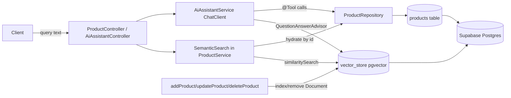

# Semantic Product Search + RAG Assistant (Spring AI 2.0 + Ollama + pgvector)

## Goal & design philosophy
Add two AI features with **near-zero changes to existing code** (only 3 one-line hooks in `ProductServiceImpl`, everything else is new additive files):
1. **Semantic search** — `/api/public/products/semantic-search?query=...` returns products ranked by meaning, not keywords.
2. **RAG shopping assistant** — `/api/public/products/assistant` chat endpoint that answers natural-language questions ("a gift for my mom under 50") using **RAG + Advisors + Chat Memory + Tool Calling**.

We keep the existing relational `products` table untouched and let Spring AI manage a separate `vector_store` table. This is the cleanest, least-intrusive pattern and the one used in the Durgesh Spring AI series.

## Why these choices (justification)
- **Spring AI 2.0.0**: Your stack is Spring Boot 4.0.6 + Java 25. Spring AI 1.x only supports Boot 3.5.x; **Spring AI 2.0.x is the only line that supports Boot 4.0/4.1**. Managed via `spring-ai-bom`.
- **Ollama (local)**: free, no API key, nothing to leak in `application.properties` (which already has plaintext secrets). `nomic-embed-text` for embeddings, `llama3.1` for chat.
- **Spring-managed `vector_store` table (not a column on `products`)**: avoids editing the `Product` entity / Hibernate `ddl-auto`, avoids Hibernate-vs-pgvector type conflicts, and matches the tutorial. Vector search returns product IDs; we **hydrate full data from the relational DB** and reuse the existing `ProductDTO` / `constructImageUrl()` mapping, so the API response shape stays identical to current search.
- **Hydrate-from-DB pattern**: keeps prices/stock authoritative in Postgres (vector metadata can go stale); great interview talking point about "source of truth".
- **Reuse `/api/public/**`**: those paths are already `permitAll()` in `WebSecurityConfig`, so **no security changes**.

## 1. Dependencies — `pom.xml`
Add the BOM (import scope) and two starters; auto-config wires `EmbeddingModel`, `ChatModel`, and `VectorStore` for us.
- `spring-ai-bom` `2.0.0` in `<dependencyManagement>`
- `org.springframework.ai:spring-ai-starter-model-ollama`
- `org.springframework.ai:spring-ai-starter-vector-store-pgvector`

## 2. Config — `src/main/resources/application.properties`
Reuse the existing Supabase datasource (single datasource shared by JPA + pgvector). Add:
- `spring.ai.ollama.base-url=http://localhost:11434`
- `spring.ai.ollama.chat.options.model=llama3.1`
- `spring.ai.ollama.embedding.options.model=nomic-embed-text`
- `spring.ai.ollama.init.pull-model-strategy=when_missing` (auto-pulls models)
- `spring.ai.vectorstore.pgvector.initialize-schema=true`
- `spring.ai.vectorstore.pgvector.dimensions=768`  ← **must match nomic-embed-text**
- `spring.ai.vectorstore.pgvector.index-type=HNSW`
- `spring.ai.vectorstore.pgvector.distance-type=COSINE_DISTANCE`

Supabase prep: `vector` extension is already enabled. If schema init fails on `hstore`/`uuid-ossp`, run `CREATE EXTENSION IF NOT EXISTS ...` once in the Supabase SQL editor.

## 3. AI beans — new `config/AiConfig.java`
Following `[config/AppConfig.java](src/main/java/com/ecommerce/project/config/AppConfig.java)` style:
- `ChatClient` bean built from auto-configured `ChatModel`, with default advisors: `QuestionAnswerAdvisor(vectorStore)` (RAG), `MessageChatMemoryAdvisor(chatMemory)` (memory), `SimpleLoggerAdvisor` (observability), plus a system prompt ("You are a shopping assistant. Only recommend products from the provided context.").
- `ChatMemory` bean: `MessageWindowChatMemory` (in-memory, last N messages).

## 4. Indexing products into the vector store — new `service/ProductIndexService` (+ `Impl`)
- `Document toDocument(Product)`: content = `productName + ". " + description + ". Category: " + categoryName`; metadata = `productId`, `price`, `specialPrice`, `category`; `Document` id = `productId` (deterministic upsert/delete).
- `index(Product)`, `remove(Long productId)`, `reindexAll()` (loads all products, pushes in batch).
- Hook into `[ProductServiceImpl.java](src/main/java/com/ecommerce/project/service/ProductServiceImpl.java)` with **3 one-line calls**: after `addProduct` save, after `updateProduct` save, and in `deleteProduct`.
- Admin reindex endpoint to seed existing data (see below).

## 5. Semantic search — extend `ProductService` / `ProductController`
- Add `ProductResponse semanticSearch(String query, Integer topK)` to `[ProductService.java](src/main/java/com/ecommerce/project/service/ProductService.java)`.
- Impl: `vectorStore.similaritySearch(SearchRequest.builder().query(query).topK(k).similarityThreshold(0.5).build())` → extract `productId` from metadata → `productRepository.findAllById(ids)` → preserve similarity order → map to `ProductDTO` via existing `ModelMapper` + `constructImageUrl()` → wrap in `ProductResponse`.
- Endpoint in `[ProductController.java](src/main/java/com/ecommerce/project/controller/ProductController.java)`: `GET /api/public/products/semantic-search` (public).

## 6. RAG assistant with tool calling — new files
- `ai/ProductTools.java`: `@Tool`-annotated read-only methods, e.g. `getProductByName(String name)` and `checkStock(String name)` backed by `ProductRepository`. Lets the LLM fetch **live price/stock** during a conversation.
- `service/AiAssistantService` (+ `Impl`): `chat(String conversationId, String message)` calls `chatClient.prompt().user(message).tools(productTools).advisors(a -> a.param(ChatMemory.CONVERSATION_ID, conversationId)).call().content()`.
- `controller/AiAssistantController.java`: `POST /api/public/products/assistant` with `AssistantRequest{conversationId, message}` → `AssistantResponse{conversationId, answer}`.
- New payloads: `payload/AssistantRequest.java`, `payload/AssistantResponse.java`.

This single endpoint demonstrates all four requested concepts: **RAG** (QuestionAnswerAdvisor + VectorStore), **Advisors** (QA + Memory + Logger), **Memory** (ChatMemory keyed by conversationId), **Tool Calling** (`@Tool` ProductTools).

## 7. Seed existing products
Add `POST /api/admin/products/reindex` (under already-secured `/api/admin/**`) calling `reindexAll()`. Run once after startup to embed current catalog. (Avoids a slow re-embed on every boot vs a `CommandLineRunner`.)

## Interview talking points to highlight
- Keyword `LIKE` vs **semantic similarity** (cosine distance over embeddings).
- **HNSW** approximate nearest-neighbor index; why dimensions must match the model (768).
- Vector store as a search index, **relational DB as source of truth** (hydrate-by-id).
- Spring AI **Advisor chain** (RAG + memory + logging) and **provider-swappable** abstraction (Ollama ↔ OpenAI = config change only).
- Tool calling lets the LLM safely query your DB for live data.

## Risks / notes
- Ollama must be running locally (`ollama serve`) with `nomic-embed-text` + `llama3.1` available; `pull-model-strategy=when_missing` auto-pulls.
- If you later change the embedding model, drop/recreate `vector_store` (dimensions are fixed at table creation).
- First semantic search only works after products are indexed (run reindex once).